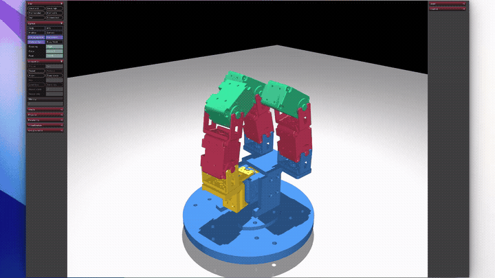

# tri_hand MuJoCo 시뮬레이션

3지 다관절 로봇 손(`tri_hand`)의 물리 시뮬레이션을 위한 MuJoCo입니다.

<p align="center">
  
  <br>
  <em>🎬 시뮬레이션 데모 </em>
</p>

---

## 💻 지원 OS 및 환경 요건

- **권장 Python 버전**: **Python 3.10**
- **지원 운영체제**:
  - **Linux** (Ubuntu 20.04 / 22.04 등)
  - **macOS** (Apple Silicon M1/M2/M3/M4 및 Intel)
  - **Windows** (반드시 **WSL2** 환경에서 실행)

---

## 🛠 OS별 환경 세팅 가이드

### 1. Linux (Ubuntu/Debian)

```bash
# 1) Python 3.10 및 venv 설치
sudo apt update
sudo apt install -y python3.10 python3.10-venv

# 2) 가상환경 생성 및 활성화
python3.10 -m venv mujoco_env
source mujoco_env/bin/activate

# 3) 의존성 패키지 설치
pip install --upgrade pip
pip install -r requirements.txt
```

---

### 2. macOS (Homebrew)

```bash
# 1) Homebrew를 통해 Python 3.10 설치
brew install python@3.10

# 2) 가상환경 생성 및 활성화
python3.10 -m venv mujoco_env
source mujoco_env/bin/activate

# 3) 의존성 패키지 설치
pip install --upgrade pip
pip install -r requirements.txt
```

---

### 3. Windows (WSL2 사용자)

> ⚠️ **주의**: Windows 호스트 터미널에서 직접 실행하지 마시고, **WSL2(Ubuntu)** 내부에서 실행해야 합니다.

1. WSL2 터미널을 실행합니다.
2. 위의 **[1. Linux]** 가이드와 동일하게 `python3.10-venv` 설치 후 가상환경을 생성하고 실행합니다.

### 4. 42 Cluster Linux (NFS / NON-sudo)

저장소 루트에 포함된 자동화 스크립트를 사용하여 1분 만에 환경을 구축할 수 있습니다.

```bash
# 1) 원클릭 환경 구축 스크립트 실행
# (NFS 캐시 우회, Goinfre 내 Miniforge 및 Python 3.10 설치, 패키지 세팅 자동 수행)
./setup_mujoco_env.sh

# 2) 가상환경 활성화 (택 1)
source activate.sh
# 또는 새 터미널 창인 경우:
conda activate /goinfre/$USER/envs/mujoco_env

# 3) 가상환경 비활성화
conda deactivate
```

💡 클러스터 자리 이동 시 참고사항:

/goinfre는 현재 PC의 로컬 디스크이므로 다른 자리로 이동하면 런타임이 유지되지 않습니다. 자리를 옮겼을 때는 해당 PC에서 리포지토리로 이동 후 다시 ./setup_mujoco_env.sh를 실행해 주시면 즉시 동일한 환경이 재구성됩니다.

---

## 🚀 시뮬레이션 실행 방법

OS 및 환경에 따라 뷰어 실행 명령어가 다릅니다.

### 📌 OS별 뷰어(GUI) 실행 명령어

- **macOS**:
  macOS의 UI 이벤트 루프 특성상 `python` 대신 MuJoCo에서 제공하는 `mjpython`을 사용해야 뷰어가 정상 실행됩니다.
  ```bash
  mjpython src/run_sim.py
  ```

- **Linux (데스크탑 GUI 환경)**:
  ```bash
  python src/run_sim.py
  ```

- **WSL2 / 헤드리스 서버 (터미널 수치 확인)**:
  WSL2 환경에서는 그래픽 드라이버 이슈로 GUI 창이 멈출 수 있으므로, 물리 엔진 검증 시 `--headless` 옵션을 권장합니다.
  ```bash
  python src/run_sim.py --headless
  ```

- **42 Cluster Linux (클러스터 데스크탑 모니터)**:
  ```bash
  # 가상환경 활성화 상태에서 실행
  python src/run_sim.py
  # 또는 가상환경 활성화 없이 심볼릭 링크로 바로 실행할 경우
  .venv/bin/python src/run_sim.py
  ```

---

## 📁 프로젝트 구조

```
tri_hand/
├── docs/               # MuJoCo 이론 및 배경 학습 자료, 데모 미디어
├── src/                # 메인 시뮬레이션 모델 및 제어 환경
│   ├── scene.xml       # 전체 시뮬레이션 씬 (바닥, 조명, 타겟 물체 등)
│   ├── hand.xml        # 로봇 손 기구학/동역학 모델
│   ├── meshes/         # 3D STL 메쉬 파일
│   └── run_sim.py      # 시뮬레이션 실행 및 손가락 제어 스크립트
├── tutorial/           # MuJoCo 모델링 기초 단계별 실습 예제
│   ├── 01_hello.xml    # 기본 세상 구성 및 자유 낙하
│   ├── 02_joints_tendon.xml # 다관절 링크 및 텐던 실습
│   └── run.py          # 튜토리얼 실행 스크립트
├── AGENTS.md           # 시뮬레이션 에이전트 지침 및 하드웨어 명세
├── requirements.txt    # 크로스 플랫폼 호환 파이썬 의존성
├── .gitignore          # 깃 추적 제외 목록 (가상환경, 캐시 등)
└── README.md           # 프로젝트 안내서
```

---

## ⚙️ 좌표계 및 제어 규칙 (개발 참고)

- **중력 방향**: `-Y` 축 (`gravity="0 -9.81 0"`)
- **손가락 관절 회전축**: `+X` 축
- **오므림(Grasp) 부호**:
  - **Finger A (상단)**: 음수(`-`) 방향
  - **Finger B, C (하단)**: 양수(`+`) 방향
- **모터 스펙 (Dynamixel XL430-W250-T)**: 최대 토크 `1.4 N·m` (`forcerange="-1.4 1.4"`)
