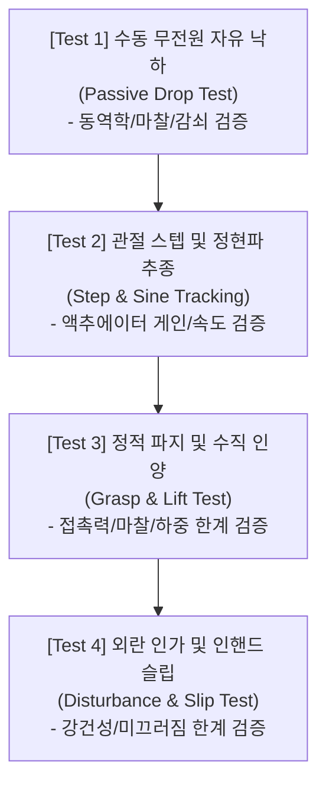

# 현실 로봇의 가상화 검증 가이드 (Part 2: 접촉 역학, 실험 파이프라인 및 실물 배포)
# Verification Guide: Real-to-Sim Transfer (Part 2: Contact, Experiments & Sim-to-Real Transfer)

> **문서 개요**: 실물 로봇 손(`tri_hand`)이 물체와 상호작용할 때 발생하는 **접촉 역학(Contact Mechanics), 4단계 시뮬레이션 검증 실험 파이프라인, 그리고 실물 배포(Sim-to-Real)를 위한 도메인 랜덤화 기법**을 다룹니다.  
> [Part 1: 기구학 및 구동계 정합](./260924_real_to_sim_part1.md)에 이어지는 문서입니다.

---

## Overview: 상호작용(Interaction)과 실물 전이의 본질

로봇 손의 핵심 목적은 물체를 '쥐고 조작하는 것(Grasping & Manipulation)'입니다.  
공중에 떠서 움직이는 로봇 팔과 달리, 로봇 손은 시뮬레이션의 성패가 100% **접촉(Contact)**에 달려 있습니다.

```
[자유 공간 운동 (Free Motion)]       [접촉 및 파지 (Contact & Grasping)]
      매끄러운 미분 방정식                   불연속적인 충돌 충격량 및 마찰 원뿔
      (Smooth ODEs)                        (Discontinuous Impacts & Friction Cones)
           │                                          │
           ▼                                          ▼
     비교적 쉽게 일치함                         미세한 파라미터 오차로도
                                            물체가 미끄러지거나 튕겨 나감
```

물체와 닿는 순간 발생하는 수식적 불연속성과 마찰 현상을 이해하지 못하면, 시뮬레이션에서는 완벽히 쥐었던 물체가 현실에서는 손가락 사이로 미끄러져 떨어지는 실패를 겪게 됩니다.

---

## Chapter 4. 파지(Grasping)를 위한 접촉 역학 (Contact Mechanics & Friction)

실제 손가락 끝(실리콘 패드, 고무, 3D 프린팅 표면)이 물체와 맞닿을 때의 복잡한 접촉 물리를 MuJoCo 파라미터로 정밀하게 표현하는 방법입니다.

```
                [접촉점 수직 반력 F_normal]
                          ▲
                          │
  손가락 끝 (Fingertip) ────┴──── 물체 표면 (Object)
                          │
                          ▼
            [접선 미끄럼 마찰 F_tangent]  (condim = 3)
            [비틀림 회전 마찰 T_torsion]  (condim = 4, Soft Contact)
            [구름 구름 저항 T_rolling]   (condim = 6)
```

### 4.1 접촉 차원(Contact Dimension, `condim`)의 물리적 의미

초보자가 MuJoCo에서 물체를 쥘 때 가장 당황하는 현상은 **"손가락 3개로 공을 꽉 쥐었는데, 공이 팽이처럼 빙글빙글 돌다가 툭 빠져나가는 현상"**입니다. 이 원인이 바로 `condim`입니다.

| `condim` 값 | 구속 자유도 | 고려되는 물리력 | 설명 및 적용 권장 |
| :---: | :---: | :--- | :--- |
| **`1`** | 1자유도 | 수직 침투 방지 반력 ($F_n$) | 마찰이 전혀 없는 완벽한 얼음판 접촉 |
| **`3`** (기본값) | 3자유도 | $F_n$ + 2방향 미끄럼 마찰력 ($F_x, F_y$) | 이상적인 점접촉(Point Contact). **접촉점을 축으로 회전하는 비틀림 저항이 없음** |
| **`4`** (강력 권장) | 4자유도 | $F_n$ + 미끄럼 마찰 + **비틀림 마찰 ($T_z$)** | 면 접촉을 하는 **소프트 핑거(Soft Finger)** 모델. 비틀림 미끄러짐 방지 |
| **`6`** | 6자유도 | 모든 방향의 힘 및 회전/구름 저항 모멘트 | 고무 바퀴나 점착성 표면 등 극도의 저항 표현 |

#### 왜 로봇 손 파지에는 `condim="4"` 이상이 필수적인가?
* 현실의 손끝(실리콘 패드나 사람 손가락)은 물체에 닿을 때 약간 눌리면서 **접촉 면적(Contact Area)**을 형성합니다.
* 이 면적 덕분에 물체가 접촉점을 축으로 회전하려 할 때 마찰 토크(Torsional Friction)가 발생하여 비틀림을 막아줍니다.
* MuJoCo 기본값인 `condim="3"`은 접촉 면적이 없는 무한히 작은 수학적 점(Point)으로 계산하므로, 물체가 회전 미끄러짐을 일으킵니다.
* **해결책**: 손끝(Fingertip)의 충돌 지오메트리에는 반드시 `condim="4"`를 명시해야 합니다.

---

### 4.2 마찰 파라미터 (`friction` 속성의 3요소)

MuJoCo의 `<geom friction="..."/>` 태그는 3개의 부동소수점 숫자를 받습니다:
```xml
<geom friction="1.2 0.005 0.0001"/>
                ─── ───── ──────
                 │    │      │
                 │    │      └─ 3) 롤링 마찰 계수 (Rolling Friction)
                 │    └──────── 2) 비틀림 마찰 계수 (Torsional Friction, condim >= 4)
                 └───────────── 1) 슬라이딩 마찰 계수 (Sliding/Coulomb Friction)
```

1. **슬라이딩 마찰 (Sliding, $1.2$)**: 물체 표면을 따라 평면으로 미끄러질 때 저항하는 쿨롱 마찰 계수.
   * PLA 플라스틱 표면: 약 $0.3 \sim 0.5$
   * 고무/실리콘 패드: 약 $1.0 \sim 1.5$
2. **비틀림 마찰 (Torsional, $0.005$m)**: 접촉면 법선 축 중심의 회전에 저항하는 가상 접촉 반경 길이(m 단위).
3. **롤링 마찰 (Rolling, $0.0001$m)**: 구체가 굴러갈 때 저항하는 모멘트 암 길이.

---

### 4.3 접촉 유연성 및 임피던스 (`solref`, `solimp`)

* **무한 강체 접촉(Rigid Contact)의 한계**:
  * 현실의 재질(플라스틱, 고무)은 힘을 받으면 미세하게 압축됩니다.
  * 시뮬레이터에서 재질을 100% 딱딱한 강체(Rigid Body)로 계산하면, 물체와 손가락이 닿는 순간 충격량이 무한대로 치솟아 수치적 폭발이나 고주파 진동(Vibration)이 발생합니다.
* **MuJoCo의 탄성 접촉 해결책**:
  * MuJoCo는 접촉면을 스프링-댐퍼 시스템으로 모델링합니다.
  * `solref="time_const dampratio"`: 접촉 시 충격을 흡수하는 시간 상수(s)와 감쇠비.
  * 손끝에 부드러운 패드가 붙어 있다면 `solref="0.01 1.0"` 처럼 약간의 순응성(Compliance)을 부여하여 현실적인 완충 효과를 구현합니다.

---

## Chapter 5. 실무 검증 파이프라인 (Step-by-Step Verification Experiments)

모델링이 완료되면, 단계별로 다음 4가지 표준 테스트를 실행하여 가상 모델을 검증합니다.



---

### 5.1 [Test 1] 수동 무전원 자유 낙하 테스트 (Passive Drop Test)

* **목적**: 모터 제어기를 배제한 상태에서 순수 기구부의 **질량, 관성, 감쇠(`damping`), 마찰(`frictionloss`)**이 맞는지 확인합니다.
* **실험 방법**:
  1. 모든 액추에이터의 목표 토크를 0으로 끕니다 (`ctrl = 0` 또는 unactuated 상태).
  2. 손가락을 공중에 수평으로 들어 올린 초기 위치(`qpos`)에서 시뮬레이션을 시작합니다.
  3. 중력(-Y)에 의해 손가락이 아래로 떨어질 때의 각도 변화 곡선을 기록합니다.
* **합격 기준**:
  * 실물 로봇 손가락의 전원을 끄고 손으로 들어 올렸다가 놓았을 때 멈추는 시간 및 튕김 횟수와 시뮬레이션 곡선이 일치해야 합니다.

---

### 5.2 [Test 2] 관절 스텝 및 정현파 추종 테스트 (Step & Sine Tracking Test)

* **목적**: 모터의 제어 파라미터(`kp`, `kv`, `armature`)와 최대 토크(`forcerange`) 설정이 실물 Dynamixel XL430의 구동 특성과 일치하는지 확인합니다.
* **실험 방법**:
  1. **스텝 응답**: 정지 상태(0 rad)에서 목표 각도(예: 1.0 rad)를 순간적으로 인가.
  2. **정현파 응답**: `run_sim.py`처럼 주기적인 왕복 운동 인가.
* **체크 포인트**:
  * **상승 시간(Rise Time)**: 실물 모터의 최고 회전 속도 한계(61 RPM)를 넘어서 비현실적으로 순식간에 도달하지 않는가?
  * **오버슈트(Overshoot)**: 목표 각도를 지나쳐 덜덜 떨리지 않는가? (떨린다면 `kv` 증가 필요)
  * **중력 처짐 오차(Steady-State Error)**: 손가락을 공중에 들고 있을 때 중력 무게로 인해 목표 각도보다 아래로 처지는 정도가 실물과 같은가?

---

### 5.3 [Test 3] 정적 파지 및 수직 인양 테스트 (Grasp & Lift Test)

* **목적**: 3개 손가락으로 대상 물체를 쥐고 들어 올릴 수 있는지, 접촉력 한계를 검증합니다.
* **실험 방법**:
  1. `src/scene.xml`의 바닥 위에 50g 무게의 구체(`ball`)를 배치합니다.
  2. 3개 손가락을 서서히 오므려 공을 감싸 쥡니다.
  3. 로봇 손 베이스를 위쪽(+Y축)으로 들어 올립니다.
* **체크 포인트**:
  * 공이 손가락 사이로 미끄러져 떨어지지 않고 함께 들어 올려지는가?
  * 각 손가락 모터의 요구 토크가 XL430 정격 한계인 **1.4 N·m** 이내로 유지되는가?

---

### 5.4 [Test 4] 외란 인가 및 인핸드 슬립 테스트 (Disturbance & Slip Test)

* **목적**: 파지 상태에서 외부 충격이나 흔들림이 발생했을 때 물체를 놓치지 않는 강건성(Robustness) 한계를 측정합니다.
* **실험 방법**:
  * 물체를 파지한 상태에서 물체 중심에 순간적인 외력(Impulse Force, 예: 0.5N, 1.0N)을 무작위 방향으로 가합니다.
* **체크 포인트**:
  * 외력이 가해졌을 때 손끝과 물체 표면의 상대 미끄러짐 변위(Slip Displacement)를 측정합니다.
  * 현실 로봇에서 손으로 물체를 살짝 쳤을 때 버티는 강도와 시뮬레이션의 버팀 강도가 유사한지 비교합니다.

---

## Chapter 6. 다음 단계: 강화학습 및 실물 배포로 가는 길 (Next Steps)

가상 환경 검증을 마친 후 실제 로봇에 제어 알고리즘을 배포(Sim-to-Real Transfer)하기 위한 핵심 기법들입니다.

### 6.1 도메인 랜덤화 (Domain Randomization)의 원리

아무리 정밀하게 측정해도 **"시뮬레이션과 현실의 물리 파라미터가 100% 같을 수는 없습니다."**  
부품의 마모, 실내 온도에 따른 모터 저항 변화, 배터리 전압 강하 등으로 물리값은 실시간으로 변합니다.

```
[결정론적 단일 환경 훈련]           [도메인 랜덤화 (Domain Randomization)]
   질량 = 0.05kg 고정                   질량 ~ Uniform(0.04kg, 0.06kg)
   마찰 = 1.0 고정                      마찰 ~ Uniform(0.7, 1.3)
   지연 = 0ms 고정                      지연 ~ Uniform(10ms, 25ms)
          │                                        │
          ▼                                        ▼
   현실에서 오차가 나면 즉시 실패         다양한 오차 환경을 겪어보아 현실에서도 안정적
```

* **방법**: 시뮬레이터에서 제어기를 학습시키거나 최적화할 때, 매 에피소드마다 물리 파라미터를 무작위 범위 내에서 조금씩 변화시킵니다.
* **효과**: 특정 시뮬레이션 수치에 과적합(Overfitting)되지 않고, 현실의 미세한 오차를 견뎌내는 강력한 강건성(Robustness)을 획득합니다.

---

### 6.2 센서 데이터 정합화 (Sensor Alignment)

시뮬레이터 내부의 변수와 실제 하드웨어의 통신 패킷을 1:1로 매핑해야 제어 코드를 수정 없이 그대로 실물에 이식할 수 있습니다.

| 측정 항목 | 실물 로봇 (Dynamixel XL430) | MuJoCo 가상 모델 (`<sensor>`) | 단위 |
| :--- | :--- | :--- | :---: |
| **관절 위치** | `Present Position` (엔코더 펄스) | `<jointpos joint="..."/>` | rad |
| **관절 속도** | `Present Velocity` (RPM) | `<jointvel joint="..."/>` | rad/s |
| **모터 부하** | `Present Current` (전류 mA $\approx$ 토크) | `<actuatorfrc actuator="..."/>` | N·m |
| **손끝 접촉력** | (필요 시) FSR 박막 센서 / 촉각 패드 | `<touch site="..."/>` | N |

---

### 6.3 실물 배포 시 안전 수칙 (Safety Transfer Protocol)

가상에서 잘 돌아가는 코드를 실물에 처음 넣을 때 하드웨어 파손을 막기 위한 필수 규칙입니다:

1. **소프트웨어 토크/전류 리밋**: 초기 테스트 시 실물 모터의 토크 한계를 정격의 30~50%로 낮추어 충돌 시 모터가 스스로 전원을 차단하도록 설정합니다.
2. **명령 속도 제한 (Velocity Slew-Rate Limiter)**: 제어 명령이 급격히 바뀔 때 모터가 튀는 현상을 막기 위해 1차 저역통과 필터(LPF)나 이동 평균 필터를 거쳐 목표 각도를 인가합니다.
3. **비상 정지(E-Stop) 하드웨어 스위치 상시 확보**: 예상치 못한 발산 동작 시 즉시 전원을 끊을 수 있는 물리 스위치를 손에 쥐고 테스트를 진행합니다.

---

## Part 2 자체 점검 체크리스트 (Self-Checklist)

- [ ] **접촉 차원 설정**: 손끝 충돌체에 비틀림 마찰이 포함되는 `condim="4"`가 적용되어 있는가?
- [ ] **마찰 계수 현실화**: 고무/실리콘/PLA 특성에 맞는 슬라이딩 및 토셔널 `friction`이 설정되어 있는가?
- [ ] **단계별 테스트 완료**:
  - [ ] Test 1: 수동 무전원 낙하 테스트 (감쇠/마찰 확인)
  - [ ] Test 2: 스텝 응답 및 정현파 추종 테스트 (모터 응답/게인 확인)
  - [ ] Test 3: 물체 파지 및 인양 테스트 (파지력/슬립 확인)
- [ ] **실물 제어기 연계**: 센서 출력 데이터 구조와 제어 루프 주기(10~20ms)가 실물 제어 환경과 일치하는가?

---

> 🔗 **관련 문서 링크**:  
> - [Part 1: 기구학 및 구동계 정합 가이드](./260924_real_to_sim_part1.md)
> - [기하학적 형상과 현실 크기 반영 가이드 (Geometric Fidelity)](./geometric_fidelity_and_scale_in_simulation.md)
> - [tri_hand 시뮬레이션 지침 (AGENTS.md)](../AGENTS.md)
